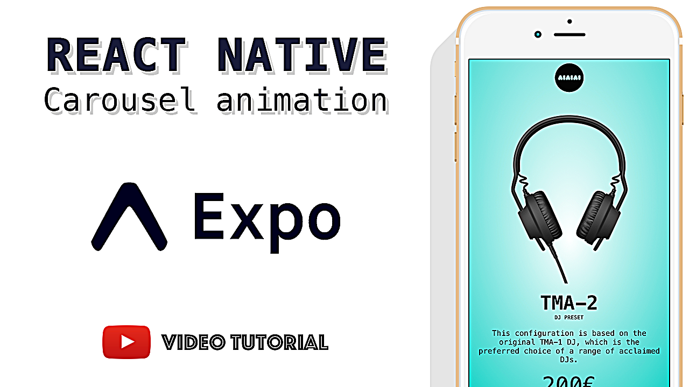

# React Native Carousel Animation

Youtube tutorial:

In this lesson we’re going to be building a react native carousel animation using Expo for creating the react-native project.

- Inspiration: https://dribbble.com/shots/2365666-Pop-up-concept
- Expo: https://expo.io/

You can find me on:

- Github: http://github.com/catalinmiron
- Twitter: http://twitter.com/mironcatalin
